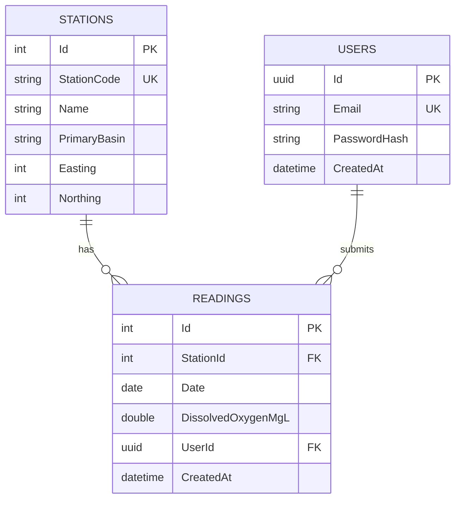

# Database schema

PostgreSQL, managed with EF Core code-first migrations. Three tables: `Stations`, `Readings`, `Users`.

## ERD

(GitHub renders this block automatically — no extra tooling needed to view it.)

Seeded from the DAERA/NIEA open dataset.

| Column | Type | Notes |
|---|---|---|
| Id | int | PK |
| StationCode | text | Unique, official DAERA ID |
| Name | text | |
| PrimaryBasin | text | |
| Easting / Northing | int? | Irish Grid reference |

## Readings

Holds both official and user-submitted readings — no separate table or flag.

| Column | Type | Notes |
|---|---|---|
| Id | int | PK |
| StationId | int | FK → Stations, required |
| Date | date | |
| DissolvedOxygenMgL | double? | |
| UserId | uuid? | FK → Users. **Null = official DAERA data, set = user-submitted** |
| CreatedAt | timestamptz | |

## Users

| Column | Type | Notes |
|---|---|---|
| Id | uuid | PK |
| Email | text | Unique |
| PasswordHash | text | Hashed, never plaintext |
| CreatedAt | timestamptz | |

## Indexes

- `Stations.StationCode` — unique
- `Users.Email` — unique
- `Readings(StationId, Date)` — composite, supports the main read query (readings for a station over a date range)

## Key decisions

- **Nullable `UserId` instead of a flag/second table** — official vs. community is derived from whether it's null, not stored separately.
- **Cascade on Station delete, SetNull on User delete** — deleting a station removes its readings (meaningless without one); deleting a user just detaches their readings rather than destroying historical data.
- **Generic `IRepository<T, TKey>`** — makes services unit-testable without a real database, despite EF Core's `DbSet<T>` already covering most of the same ground.
- **Fluent API over data annotations** — keeps `Domain` free of any EF Core dependency.

## Data quality note

DAERA flag possible erroneous values in this dataset. Investigation found ~0.2% of dissolved oxygen readings (320 of 151,037) above a realistic 20 mg/l ceiling, clustered mostly in 1992–93. Imported unmodified rather than filtered — the import logs anything above 20 mg/l so it's easy to find later. Any user-facing display of this data should carry DAERA's disclaimer.

## Migrations

| Migration | Date | Summary |
|---|---|---|
| InitialCreate | 2026-08-18 | Initial schema |

## Open questions

- Can users add their own stations, not just readings at existing ones? Currently no — `StationId` is required and must reference an existing station.
- Nutrient parameters beyond dissolved oxygen aren't modelled yet — would need a more generic parameter/value structure rather than fixed columns.
