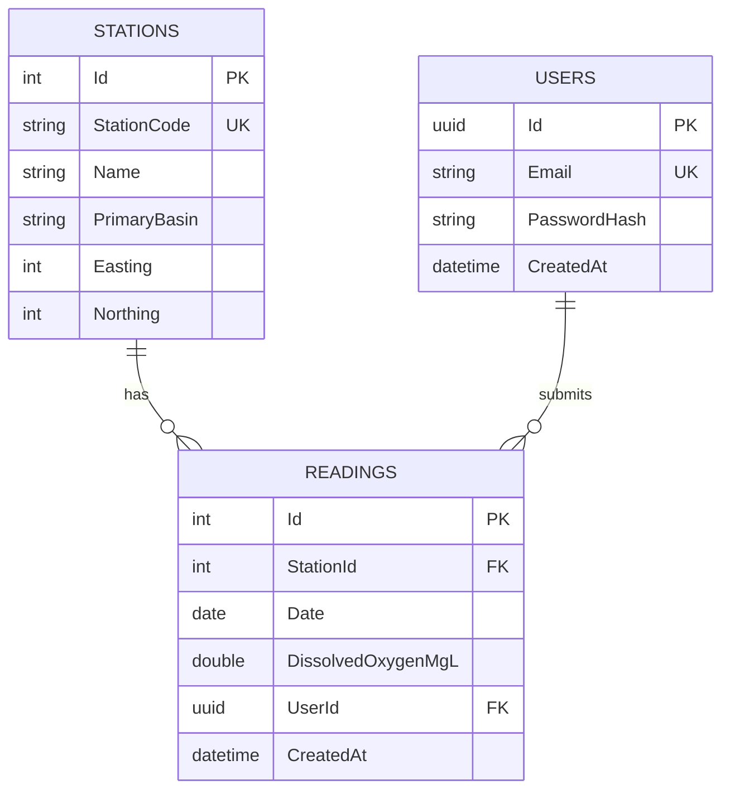

# NiWaterWatch — database schema

PostgreSQL 16, managed entirely through EF Core code-first migrations (no hand-written SQL). Three tables: `Stations`, `Readings`, `Users`.

## Entity relationship diagram

(GitHub renders this block automatically — no extra tooling needed to view it.)

## Tables

### Stations

| Column | Type | Notes |
|---|---|---|
| `Id` | `int` (identity) | Primary key |
| `StationCode` | `text` | **Unique.** Official DAERA station identifier |
| `Name` | `text` | Human-readable location name |
| `PrimaryBasin` | `text` | River basin (e.g. Upper Bann, Foyle) |
| `Easting` / `Northing` | `int?` | Grid reference coordinates |

Seeded from the DAERA/NIEA open dataset (Phase 4). Not user-created in the current design — see [Open design questions](#open-design-questions).

### Readings

| Column | Type | Notes |
|---|---|---|
| `Id` | `int` (identity) | Primary key |
| `StationId` | `int` | **Required.** FK → `Stations.Id` |
| `Date` | `date` | Date of the reading |
| `DissolvedOxygenMgL` | `double?` | The measurement itself |
| `UserId` | `uuid?` | FK → `Users.Id`. **Null = official DAERA data. Set = user-submitted.** |
| `CreatedAt` | `timestamptz` | Row creation time |

One table serves both official and community readings — there's no separate table or boolean flag for it. See [Design decisions](#design-decisions) below.

### Users

| Column | Type | Notes |
|---|---|---|
| `Id` | `uuid` | Primary key |
| `Email` | `text` | **Unique** |
| `PasswordHash` | `text` | Never store plaintext — hashed at the service layer (Phase 7) |
| `CreatedAt` | `timestamptz` | Row creation time |

## Indexes

| Index | Table | Columns | Type | Why |
|---|---|---|---|---|
| `IX_Stations_StationCode` | Stations | `StationCode` | Unique | Prevents duplicate station imports |
| `IX_Users_Email` | Users | `Email` | Unique | Prevents duplicate registrations |
| `IX_Readings_StationId_Date` | Readings | `StationId`, `Date` | Composite | Matches the app's most common query: "readings for station X between two dates" — station detail page and trend view both hit this |
| `IX_Readings_UserId` | Readings | `UserId` | Standard | Auto-created by EF Core for the FK relationship |

## Design decisions

**Why `Reading.UserId` is nullable instead of a separate table or a boolean flag.**
"Is this official or community-submitted" isn't stored as a fact — it's derived by checking whether `UserId` is null. Every reading — imported or submitted — lives in the same table, same columns, same query path. One column does the job a flag-plus-relationship or a second table would otherwise need.

**Why the two foreign keys on `Reading` have different delete behaviors.**
- `StationId` → `Cascade`: deleting a station deletes its readings with it. A reading pointing at a station that no longer exists is meaningless.
- `UserId` → `SetNull`: deleting a user's account does *not* delete their readings — it just nulls the `UserId`, and the row reverts to looking like an unattributed entry. Deleting your account shouldn't destroy water quality data that's become part of the historical record.

**Why there's a generic `IRepository<T, TKey>` instead of querying `AppDbContext` directly.**
EF Core's `DbSet<T>` already behaves like a repository, so this isn't solving a technical gap — it's making services testable in isolation. A service depending on `IRepository<T, TKey>` can be unit tested with a fake implementation, no real database or EF Core involved. The interface lives in `Domain` (framework-free), the implementation in `Infrastructure` — same dependency-inversion principle as the rest of the solution.

**Why Fluent API instead of data annotation attributes on the entities.**
Attributes (`[Key]`, `[Required]`, etc.) would require `Domain` to reference `Microsoft.EntityFrameworkCore`, breaking the goal of keeping `Domain` dependency-free. All EF-specific configuration lives in `AppDbContext.OnModelCreating` instead, inside `Infrastructure`, where it belongs.

## Migration history

| Migration | Date | Summary |
|---|---|---|
| `InitialCreate` | 2026-08-18 | Initial schema — `Stations`, `Readings`, `Users`, all indexes and FK relationships described above |

Add a row here each time a new migration is created — this table becomes a running log of how the schema has evolved, without needing to dig through the actual EF-generated migration files to answer "when did we add X."

## Known data quality issues

DAERA's own dataset page carries a caveat: results may contain errors from typos, sampling mistakes, or contamination, "usually several orders of magnitude above expected values." Investigating the dissolved oxygen data confirmed this, with some important nuance:

- **99% of readings sit at or below 14.50 mg/l** — right at the real physical ceiling for dissolved oxygen saturation in river water. The dataset is overwhelmingly clean.
- **A small tail (0.21%, 320 of 151,037 rows) exceeds 20 mg/l**, topping out at 41.90 mg/l. These are almost certainly not valid measurements — but they're also not the "orders of magnitude" scale of error DAERA describes; the worst value is roughly 3x a plausible high reading, not 10–100x, so the exact cause isn't something we can determine from the data alone (possible decimal/unit error, possible instrument fault, possibly something else).
- **The worst offenders cluster heavily in 1992–1993**, rather than being scattered randomly through the 34-year range — suggestive of a systematic issue at that point in time (a specific instrument, a data entry process from the pre-digital era) rather than one-off human error, though again, not something confirmable from the CSV alone.

**Decision: import all rows unmodified.** Government data shouldn't be silently altered or dropped based on a threshold we can't fully justify — a future reader of this dataset deserves the same numbers DAERA published, not a version quietly filtered by an importer's assumptions. The import logs a warning for any row above 20 mg/l so the questionable rows are easy to find later, without changing what actually lands in the database. Any future user-facing display of this data (API responses, the frontend) should carry DAERA's own disclaimer alongside it, rather than presenting every number as equally reliable.

## Open design questions

Deliberately deferred, not forgotten:

- **Can users add their own stations, not just readings at existing ones?** Currently `Reading.StationId` is required and must reference an existing station — so no. Extending this would reuse the same nullable-owner pattern already on `Reading` (e.g. a nullable `CreatedByUserId` on `Station`), plus a moderation story to prevent junk entries.
- **Nutrient parameters beyond dissolved oxygen.** The schema currently models one parameter (`DissolvedOxygenMgL`) as a fixed column. Adding more DAERA parameters (nitrogen, phosphorus, etc.) as fixed columns doesn't scale — a more generic `ParameterType` + `Value` structure would be the way to widen this later.
